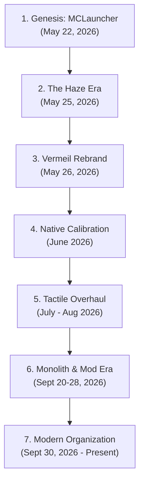
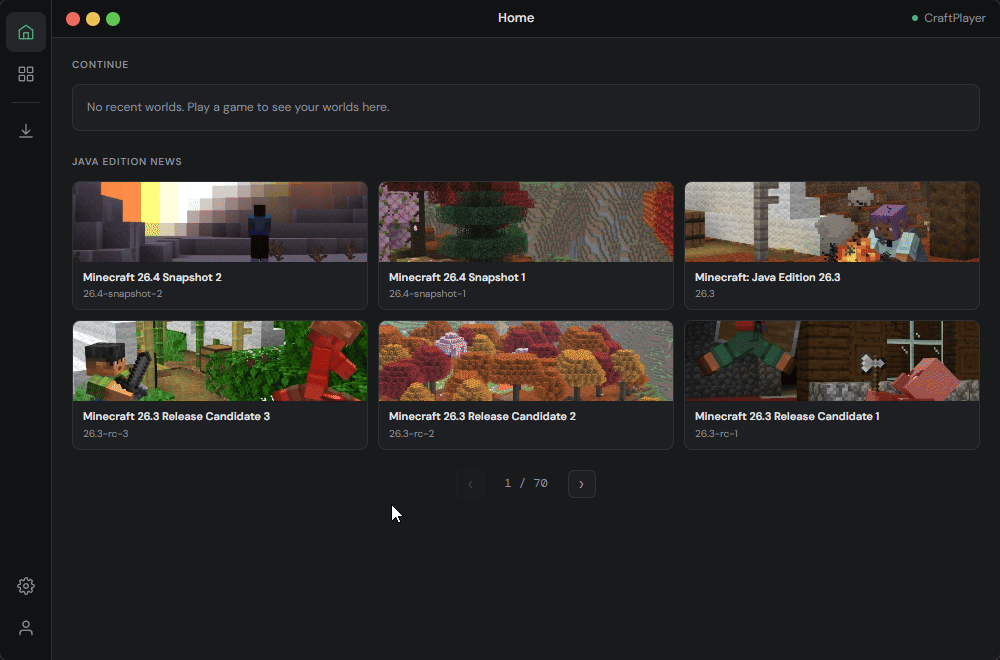
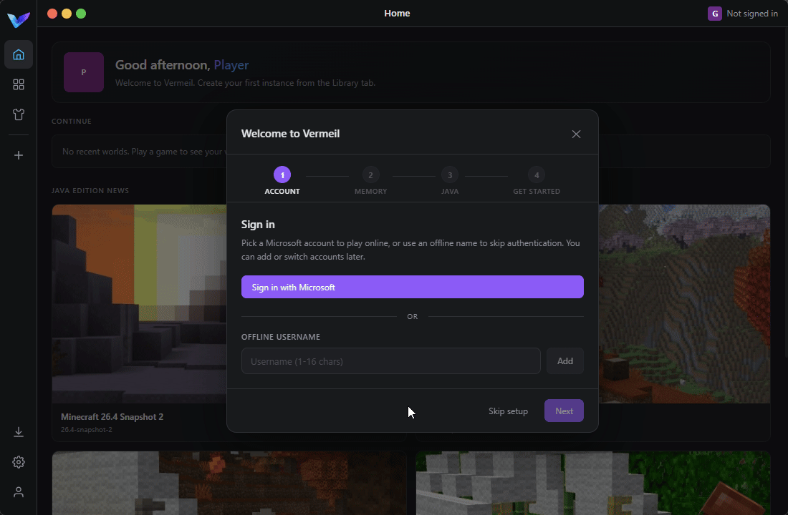
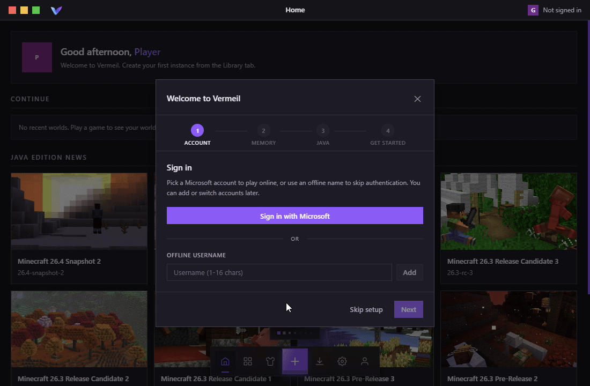
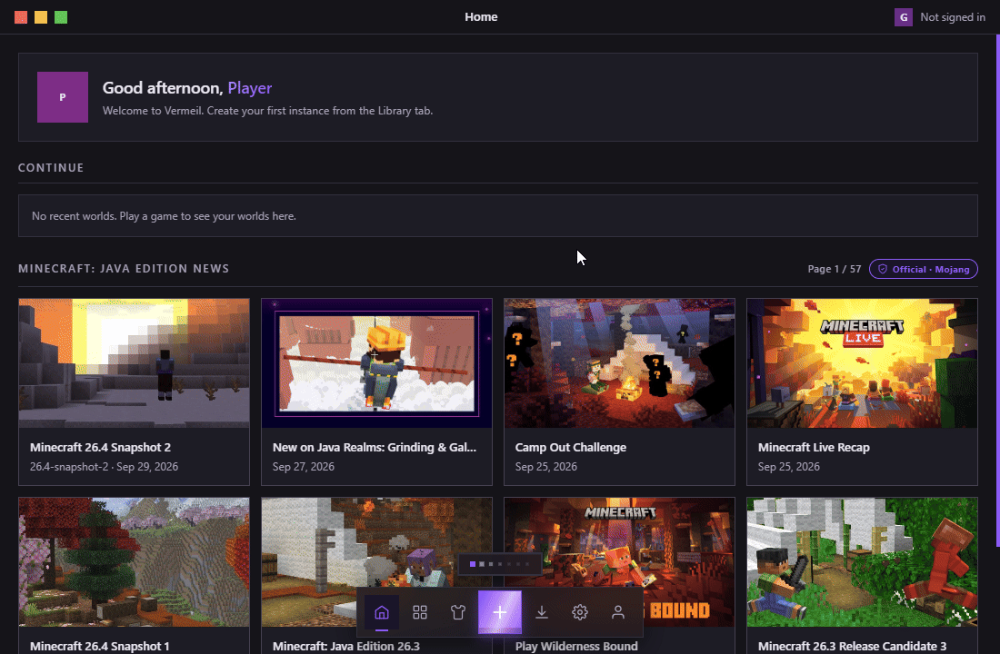
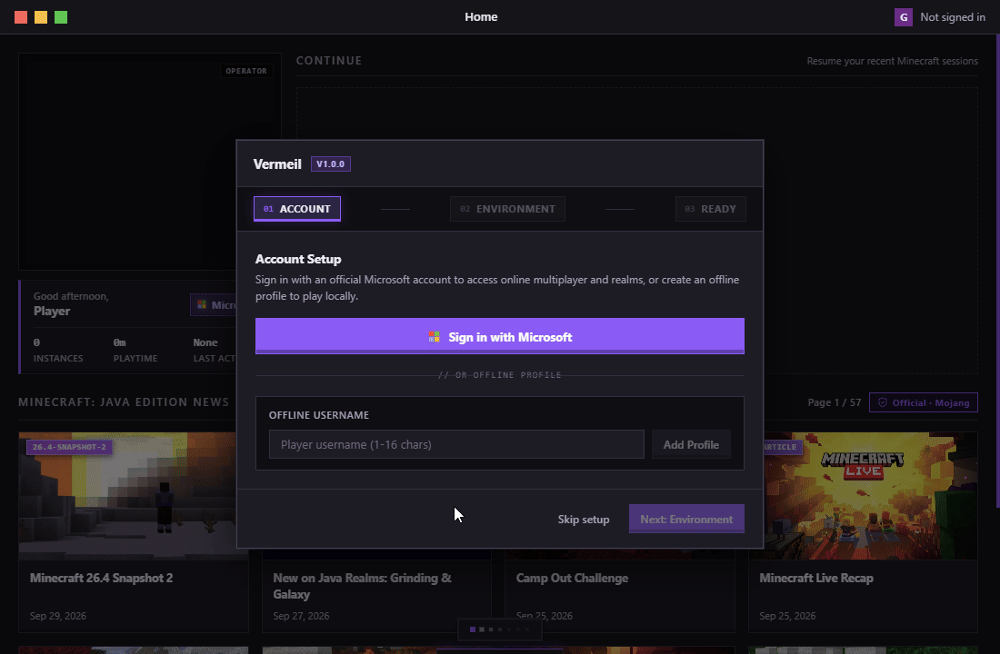
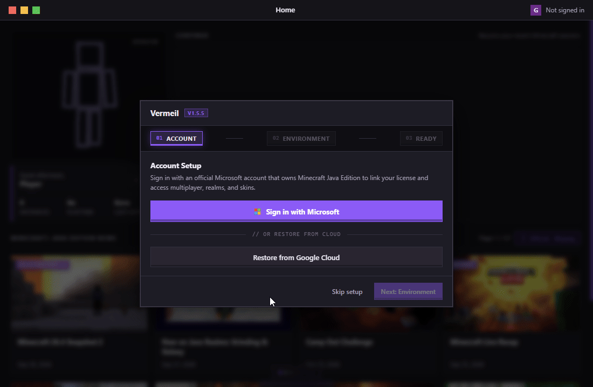
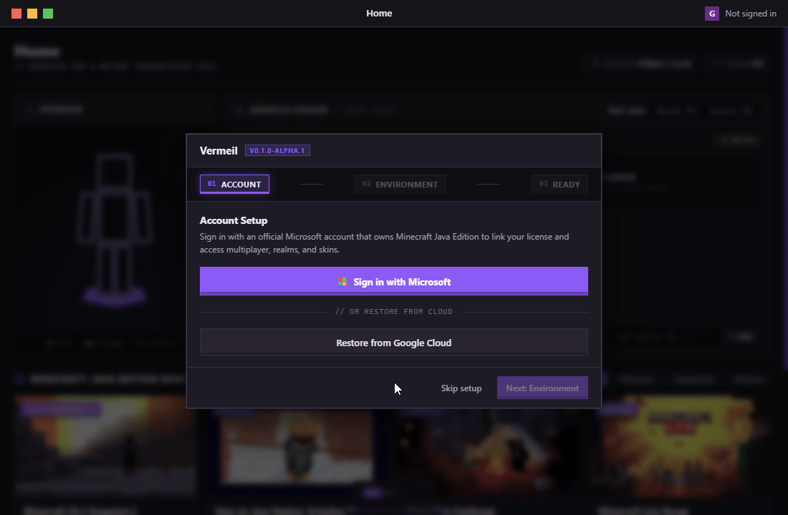

# Evolution of Vermeil: Historical Milestones & UI Progression

Vermeil began in May 2026 as an exploration into building an ultra-fast, local-first Minecraft launcher without webview lag or telemetry. This document chronicles its architectural and visual journey across seven landmark eras.

---

### Project Timeline

---

### 1. Genesis: MCLauncher (May 22, 2026)
* **First Release:** `v0.1.0` (May 22, 2026, 18:15 UTC)
* **Initial Stack:** Tauri 2 (Rust) + SolidJS (TypeScript) + Vite

The very first prototype proved the core premise: a zero-bloat desktop launcher with instant reactivity and zero Electron memory overhead.

#### Key Capabilities:
- **Tauri 2 + SolidJS Core:** Replaced heavy legacy runtimes with a native Rust backend and SolidJS reactive signals for sub-second startup times and zero VDOM overhead.
- **Multi-Loader Launch Pipeline:** Built native version resolution and classpath assembly for Vanilla, Fabric, Quilt, NeoForge, and Forge from Day 1.
- **Microsoft OAuth 2.0 PKCE:** Direct browser-based Microsoft and Xbox Live token exchange with credentials sealed in the OS keystore.
- **Adoptium OpenJDK Auto-Provisioning:** Automated runtime resolution, download, and unpackaging of Java 8, 17, and 21.
- **Local-First JSON Storage:** Plain human-readable JSON manifests (`config.json`, `instance.json`) on disk instead of opaque or corruptible databases.

  

---

### 2. The Haze Era: Haze v0.2.0 (May 25, 2026)
* **Milestone Release:** `v0.2.0` (May 25, 2026)

Renamed to **Haze**, this era established UX paradigms that remain central to the launcher today.

#### Key Capabilities:
- **Sidebar Quick Pins:** First implementation of pinning up to 3 instances to the navigation rail with loader color tinting and instant launch shortcuts.
- **Multi-Account Skin Cache:** Direct skin texture fetching via `get_account_skin` and per-account face rendering in Account view without resetting inactive accounts.
- **Per-Instance Log Buffers:** Discrete game log streaming buffers with `{ instanceId, line }` IPC payloads to prevent console cross-talk.
- **Smart Java Version Mapping:** Automatic Java mapping for legacy versions (Java 8 for 1.8.9–1.16.5), modern releases (Java 17 for 1.17–1.20.4), and latest Minecraft (Java 21 for 1.20.5+).
- **Semaphore-Bounded Downloader:** Parallel queue with SHA-1 hash checks, atomic `.part` verification, and 3x retry resilience.

  

---

### 3. The Vermeil Rebrand: Vermeil v0.1.0 Prototype (May 26, 2026)
* **Milestone Release:** `v0.1.0` (May 26, 2026, 16:20 UTC)

The project permanently adopted the name **Vermeil**, accompanied by a major visual redesign and local wardrobe tools.

#### Key Capabilities:
- **Offline Character Studio:** Decoupled local skin library allowing users to manage, preview, and switch wardrobes offline with 3D WebGL rendering (classic & slim model variants).
- **Modpack & Archive Importer:** Native `.mrpack` (Modrinth) and CurseForge `.zip` archive manifest parsing with automated dependency graph traversal.
- **First-Run Onboarding Wizard:** Hardware-aware setup measuring total physical RAM to calibrate suggested client heap sizes.
- **Custom NSIS Windows Installer:** Clean Windows installer with silent passive updates and optional complete user-data purge on uninstallation.

  

---

### 4. Core Expansion & Native Calibration: Vermeil v0.2.2 – v0.6.0 (June 2026)
* **Milestone Releases:** `v0.3.0` (June 14) → `v0.5.0` (June 15) → `v0.6.0` (June 20)

A rapid series of core updates that stabilized process lifecycles, native window management, and laid the groundwork for in-game client features.

#### Key Capabilities:
- **Graceful Process Lifecycle:** Integrated `WM_CLOSE` (Windows) and `SIGTERM` (Linux) handling so world chunk saves flush to disk cleanly before exit without false crash notifications.
- **Win32 Window Calibration:** Native `ShowWindow(SW_MAXIMIZE)` window scaling and GLFW resolution presets from 720p through 4K.
- **Animated Custom Capes & Companion Proof-of-Concept:** First custom animated cape engine (GIF, APNG, WebP) with 3D skin model placement, alongside the earliest experimental Fabric companion mod tests.
- **Storage Profile Migration:** Moved launcher data from roaming profiles into `%LOCALAPPDATA%\Vermeil` on Windows and `~/.local/share/Vermeil` on Linux to prevent profile disk bloat.
- **Industrial Visual Redesign:** Replaced early rounded aesthetics with sharp, industrial dark surfaces and chunky mechanical toggle switches.

  

---

### 5. Tactile Overhaul & UI Evolution: Vermeil v0.7.4 – v0.8.5 (July – August 2026)
* **Milestone Releases:** `v0.7.4` (June 28) → `v0.8.0` (August 14) → `v0.8.5` (September 3)

A transformative summer refactor that introduced Vermeil's physical design language and advanced memory mechanics.

#### Key Capabilities:
- **Origins of the Tactile Design System:** Introduced 3D beveled buttons with physical depth (`--btn-depth`), hover lift, segmented plate tabs, and replaced raw `<select>` elements with custom tactile dropdowns.
- **Adaptive Memory Breakdown:** Dynamic heap calculator illustrating the exact allocation rationale (base OS reserve + loader runtime overhead + active mod count + shader buffers).
- **Advanced Cape Studio:** Built 8x canvas zooming, angle snapping, and multi-channel hex/RGB color pickers for custom cape creation.
- **Full-Page Creation Decks:** Converted instance creation from cramped modal overlays into dedicated full-page configuration decks.
- **Animated Boot Splash Engine:** Integrated hardware-accelerated splash animations with smooth progress transitions.

  

---

### 6. Monolith & Production Maturity: Vermeil v1.0.0 – v1.5.5 (September 2026)
* **Milestone Releases:** `v1.0.0 GA` (Sept 20) → `v1.5.5` (Sept 28)

A comprehensive release cycle culminating in full feature maturity and the introduction of in-game client integration.

#### Key Capabilities:
- **Birth of the Companion Mod (`Vermeil-Companion`):** In-game client companion mod built for legacy Forge 1.8.9 and modern Fabric/NeoForge using Stonecutter with Mixin/ASM hooks, FOV sprinting effect patches, and in-game cape rendering.
- **Zero-Telemetry Cloud Settings Sync:** Sandboxed Google Drive `appDataFolder` integration to synchronize portable settings (theme, keybinds, lifetime playtime) across devices with local DPAPI/Secret Service encryption.
- **CurseForge API Parity:** Unified search, browsing, version resolution, and download tracking across both Modrinth and CurseForge ecosystems.
- **Persistent Lifetime Telemetry:** Dual-ledger activity persistence tracking monotonic lifetime playtime and single-pass NBT world save analysis.
- **Ephemeral Share Codes:** Cloudflare Worker + D1 backed 3-minute ephemeral codes for instant, zero-telemetry instance blueprint sharing.
- **Client GC Tuning Presets:** Hardware-tiered garbage collection presets (Shenandoah, ZGC, G1GC) calibrated for client heap efficiency.

  

  

---

### 7. Modern Architecture: Vermeil v0.1.0-alpha.1 (Current)
* **Milestone Release:** `v0.1.0-alpha.1` (September 30, 2026)

To establish an open, long-term foundation, the project transitioned to the official **`VermeilDev`** organization:
- **Baseline Reboot:** Restarted SemVer cleanly at `0.1.0-alpha.1` for community release under GPL-3.0 with closed-contribution stability policy.
- **Tactile Bento Design System:** Overhauled UI with modular Bento panels (`.bento-card`), recessed input wells (`#0f0e13`), 3D action buttons with physical depth (`--btn-depth`), and strict single-affordance restraint.
- **5 Dynamic Themes with Shell Icon Sync:** Emerald, Vermeil, Amber, Cobalt, and Obsidian themes with in-process Win32 COM shell shortcut (`.lnk`) and taskbar icon synchronization.
- **Multi-Repo Split:** Spun out the Java companion mod into its own dedicated multi-loader repository (`VermeilDev/Vermeil-Companion`), consumed strictly as a runtime dependency.
- **Cryptographic Dual-Channel Updater:** Minisign-signed updates (`stable` vs `experimental`) checking raw GitHub manifests on the `updates` branch to avoid API rate limits.
- **Windows Storage Footprint Calibration:** In-process Win32 registry synchronization updating `EstimatedSize` under Windows "Installed Apps" to reflect genuine `%LOCALAPPDATA%\Vermeil` disk usage.

  

